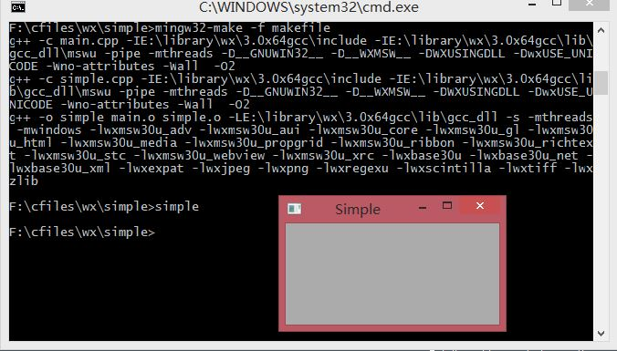
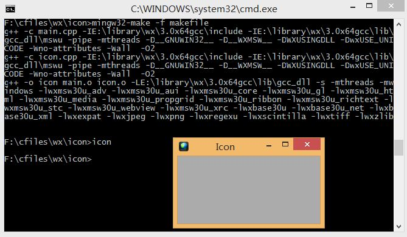
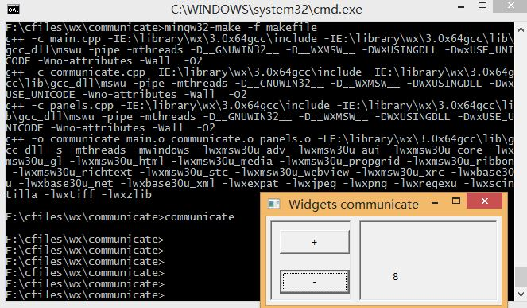

这里会展示创建wxWidgets应用程序的需要的基础。首先我们创建第一个示例程序，展示如何显示一个图标。接着我们创建一个简单例程展示事件的使用。最后，我们会看到wxWidgets程序中部件之间是如何交流的。
###一个简单的应用程序
首先，我们创建一个非常基础的wxWidgets程序。<br/>
__simple.h__<br/>
```C++
#ifndef SIMPLE_H
#define SIMPLE_H
#include <wx/wx.h>

class Simple:public wxFrame
{
public:
	Simple(const wxString& title);
};
#endif
```
__simple.cpp__<br/>
```C++
#include "simple.h"

Simple::Simple(const wxString& title):wxFrame(NULL, wxID_ANY, title, wxDefaultPosition, wxSize(250, 150))
{
	Centre();
}
```
__main.h__<br/>
```C++
#ifndef MAIN_H
#define MAIN_H
#include <wx/wx.h>

class My App:public wxApp
{
public:
	virtual bool OnInit();
};
#endif
```
__main.cpp__<br/>
```C++
#include "main.h"
#include "simple.h"
IMPLEMENT_APP(MyApp)

bool MyApp::OnInit()
{
	Simple *simple = new Simple(wxT("Simple"));
	simple->Show(true);

	return true;
}
```
这个非常简单的例程结果就是在屏幕上显示一个小窗体。这个窗体被设置为显示在中间。<br/>
```
Centre();
```
上面这个方法把窗体窗体显示在窗体中间。<br/>
```
IMPLEMENT_APP(MyApp)
```
实现这个程序的代码隐藏在这个宏后。这个只是复制和粘贴的代码，我们通常不用管它。<br/>
接下来是编译这个例程，教程里用的是unix，由于我用的是windows，因而下面我用mingw和对应的wxWidgets库来编译这个例程。由于条件限制，我将用[64位的TDM-GCC的mingw-4.8.1-3](http://tdm-gcc.tdragon.net/download)及[wxWidgets官方](http://www.wxwidgets.org)在其sourceforge上给出的[wxWidgets-3.0.0-rc2的用mingw编译成的库](http://sourceforge.net/projects/wxwindows/files/3.0.0-rc2/)来编译这个例程。<br/>
首先是makefile的书写。<br/>
```Makefile
#指定头文件的路径
CFLAGS = -IE:\library\wx\3.0x64gcc\include -IE:\library\wx\3.0x64gcc\lib\gcc_dll\mswu -pipe -mthreads -D__GNUWIN32__ -D__WXMSW__ -DWXUSINGDLL -DwxUSE_UNICODE -Wno-attributes -Wall  -O2

#链接器要链接的库文件
LIBS = -LE:\library\wx\3.0x64gcc\lib\gcc_dll -s -mthreads -mwindows -lwxmsw30u_adv -lwxmsw30u_aui -lwxmsw30u_core -lwxmsw30u_gl -lwxmsw30u_html -lwxmsw30u_media -lwxmsw30u_propgrid -lwxmsw30u_ribbon -lwxmsw30u_richtext -lwxmsw30u_stc -lwxmsw30u_webview -lwxmsw30u_xrc -lwxbase30u -lwxbase30u_net -lwxbase30u_xml -lwxexpat -lwxjpeg -lwxpng -lwxregexu -lwxscintilla -lwxtiff -lwxzlib

#要生成的目标文件
objects = main.o simple.o

simple: $(objects)
	g++ -o simple $(objects) $(LIBS)

main.o: main.cpp simple.h main.h
	g++ -c main.cpp $(CFLAGS)	
simple.o: simple.h
	g++ -c simple.cpp $(CFLAGS)

.PHONY:clean
clean:
	rm simple $(objects)
```
编译及运行效果图<br/>


###应用程序图标
在这个例程里，我们将给我们的应用提供一个图标。它会显示在窗体的左上角。这个图标是一这个程序的图标标识。<br/>
__icon.h__<br/>
```cpp
#ifndef ICON_H
#define ICON_H
#include <wx/wx.h>

class Icon:public wxFrame
{
public:
	Icon(const wxString &title);
};
#endif
```
__icon.cpp__<br/>
```cpp
#include "icon.h"
Icon::Icon(const wxString &title)
	:wxFrame(NULL, wxID_ANY, title, wxDefaultPosition, wxSize(250, 150))
{
	SetIcon(wxIcon(wxT("web.ico"), wxBITMAP_TYPE_ICO, -1, -1));
	Centre();
}
```
__main.h__<br/>
```cpp
#ifndef MAIN_H
#define MAIN_H
#include <wx/wx.h>
class MyApp:public wxApp
{
public:
	virtual bool OnInit();
};
#endif
```
__main.cpp__<br/>
```cpp
#include "main.h"
#include "icon.h"

IMPLEMENT_APP(MyApp)

bool MyApp::OnInit()
{
	Icon *icon = new Icon(wxT("Icon"));
	icon->Show(true);

	return true;
}
```
在这里，我们显示了一个名为web.ico的图标
```cpp
SetIcon(wxIcon(wxT("web.ico"), wxBITMAP_TYPE_ICO, -1, -1));
```
英文原版此处所用的是xpm格式的图标，由于我找不到xpm格式图标，因而参照[wxWidgets官方文档](http://docs.wxwidgets.org/stable/wx_wxicon.html)的说明，把图标改成了ico格式。<br/>
对应于这个应用的makefile为：
```Makefile
#指定头文件的路径
CFLAGS = -IE:\library\wx\3.0x64gcc\include -IE:\library\wx\3.0x64gcc\lib\gcc_dll\mswu -pipe -mthreads -D__GNUWIN32__ -D__WXMSW__ -DWXUSINGDLL -DwxUSE_UNICODE -Wno-attributes -Wall  -O2

#链接器要链接的库文件
LIBS = -LE:\library\wx\3.0x64gcc\lib\gcc_dll -s -mthreads -mwindows -lwxmsw30u_adv -lwxmsw30u_aui -lwxmsw30u_core -lwxmsw30u_gl -lwxmsw30u_html -lwxmsw30u_media -lwxmsw30u_propgrid -lwxmsw30u_ribbon -lwxmsw30u_richtext -lwxmsw30u_stc -lwxmsw30u_webview -lwxmsw30u_xrc -lwxbase30u -lwxbase30u_net -lwxbase30u_xml -lwxexpat -lwxjpeg -lwxpng -lwxregexu -lwxscintilla -lwxtiff -lwxzlib

#要生成的目标文件
objects = main.o icon.o

icon: $(objects)
	g++ -o icon $(objects) $(LIBS)

main.o: main.cpp icon.h main.h
	g++ -c main.cpp $(CFLAGS)	
icon.o: icon.h
	g++ -c icon.cpp $(CFLAGS)

.PHONY:clean
clean:
	rm simple $(objects)
```
编译及运行效果图<br/>

###简单的按钮
在下面的例程里，我们将在一个框架部件里创建一个按键，同时，我们将展示如何创建一个简单的事件。<br/>
__button.h__<br/>
```cpp
#ifndef BUTTON_H
#define BUTTON_H

#include <wx/wx.h>
class Button:public wxFrame
{
public:
	Button(const wxString &title);

	void OnQuit(wxCommandEvent &event);
};

#endif
```
__button.cpp__<br/>
```cpp
#include "button.h"

Button::Button(const wxString& title)
	: wxFrame(NULL, wxID_ANY, title, wxDefaultPosition, wxSize(270, 150))
{
	wxPanel *panel = new wxPanel(this, wxID_ANY);

	wxButton *button = new wxButton(panel, wxID_EXIT, wxT("Quit"), wxPoint(20, 20));
	Connect(wxID_EXIT, wxEVT_COMMAND_BUTTON_CLICKED, wxCommandEventHandler(Button::OnQuit));
	button->SetFocus();
	Centre();
}

void Button::OnQuit(wxCommandEvent & WXUNUSED(event))
{
	Close(true);
}
```
__main.h__<br/>
```cpp
#ifndef MAIN_H
#define MAIN_H

#include <wx/wx.h>
class MyApp:public wxApp
{
public:
	virtual bool OnInit();
};

#endif
```
__main.cpp__<br/>
```cpp
#include "main.h"
#include "button.h"

IMPLEMENT_APP(MyApp)

bool MyApp::OnInit()
{
	Button *btnapp = new Button(wxT("Button"));
	btnapp->Show(true);

	return true;
}
```
首先我们创建了一个_wxPanel_部件，它会被放置在一个_wxFrame_部件内部。
```cpp
wxPanel *panel = new wxPanel(this, wxID_ANY);
```
然后我们创建了一个_wxButton_部件，它放在刚刚的面板(panel)里。这里给要创建的按钮用了一个预定义的宏*wxID_EXIT*，这个宏会在按钮上显示一个退出图标（事实上，我并没有在生成的可执行文件里找到）。_wxT("Quit")_是说这个按钮的标签为"Quit"。这个按钮会被放置在坐标为(20, 20)的位置（指这个按钮的左上角坐标）。这个坐标系的原点在整个面板的左上角。
```cpp
wxButton *button = new wxButton(panel, wxID_EXIT, wxT("Quit"), wxPoint(20, 20));
```
如果我们点击这个按钮，那么一个*wxEVT_COMMAND_BUTTON_CLICKED*（即按钮点击事件）就生成了。我们将这个事件跟自定义的按钮类的_OnQuit()_方法连接在一起。那么当我们点击这个按钮里，_OnQuit()_方法就会被调用。
```cpp
Connect(wxID_EXIT, wxEVT_COMMAND_BUTTON_CLICKED, wxCommandEventHandler(Button::OnQuit));
```
我们将按钮设置成物理焦点，因此如果我们按下回车键，按钮将被“点击”。在_OnQuit()_方法里，我们调用了_Close()_，用来关闭我们的程序。
```cpp
button->SetFocus();

Close(true);
```
相应的makefile可根据上面的示例进行修改，然后进行编译和运行。
###部件间交流
了解部件在应用程序里是如何交流的是非常重要的。<br/>
__panels.h__<br/>
```cpp
#ifndef PANELS_H
#define PANELS_H

#include <wx/wx.h>
#include <wx/panel.h>
class LeftPanel:public wxPanel
{
public:
	LeftPanel(wxPanel *parent);

	void OnPlus(wxCommandEvent &event);
	void OnMinus(wxCommandEvent &event);

	wxButton *m_plus;
	wxButton *m_minus;
	wxPanel *m_parent;
	int count;
};

class RightPanel:public wxPanel
{
public:
	RightPanel(wxPanel *parent);

	void OnSetText(wxCommandEvent &event);

	wxStaticText *m_text;
};

const int ID_PLUS = 101;
const int ID_MINUS = 102;

#endif
```
__communicate.h__<br/>
```cpp
#ifndef COMMUNICATE_H
#define COMMUNICATE_H

#include "panels.h"
#include <wx/wxprec.h>
class Communicate:public wxFrame
{
public:
	Communicate(const wxString &title);

	LeftPanel *m_lp;
	RightPanel *m_rp;
	wxPanel *m_parent;
};

#endif
```
__communicate.cpp__<br/>
```cpp
#include "communicate.h"
Communicate::Communicate(const wxString &title)
	:wxFrame(NULL, wxID_ANY, title, wxDefaultPosition, wxSize(290, 150))
{
	m_parent = new wxPanel(this, wxID_ANY);

	wxBoxSizer *hbox = new wxBoxSizer(wxHORIZONTAL);

	m_lp = new LeftPanel(m_parent);
	m_rp = new RightPanel(m_parent);

	hbox->Add(m_lp, 1, wxEXPAND|wxALL, 5);
	hbox->Add(m_rp, 1, wxEXPAND|wxALL, 5);

	m_parent->SetSizer(hbox);

	this->Centre();
}
```
__panels.cpp__<br/>
```cpp
#include <wx/stattext.h>
#include "communicate.h"

LeftPanel::LeftPanel(wxPanel *parent)
	:wxPanel(parent, -1, wxPoint(-1, -1), wxSize(-1, -1), wxBORDER_SUNKEN)
{
	count = 0;
	m_parent = parent;
	m_plus = new wxButton(this, ID_PLUS, wxT("+"), wxPoint(10, 10));
	m_minus = new wxButton(this, ID_MINUS, wxT("-"), wxPoint(10, 60));
	Connect(ID_PLUS, wxEVT_COMMAND_BUTTON_CLICKED,
		wxCommandEventHandler(LeftPanel::OnPlus));
	Connect(ID_MINUS, wxEVT_COMMAND_BUTTON_CLICKED,
		wxCommandEventHandler(LeftPanel::OnMinus));
}

void LeftPanel::OnPlus(wxCommandEvent &WXUNUSED(event))
{
	count++;

	Communicate *comm = (Communicate *)m_parent->GetParent();
	comm->m_rp->m_text->SetLabel(wxString::Format(wxT("%d"), count));
}

void LeftPanel::OnMinus(wxCommandEvent &WXUNUSED(event))
{
	count --;

	Communicate *comm = (Communicate *)m_parent->GetParent();
	comm->m_rp->m_text->SetLabel(wxString::Format(wxT("%d"), count));
}

RightPanel::RightPanel(wxPanel *parent)
	:wxPanel(parent, wxID_ANY, wxDefaultPosition, wxSize(270, 150), wxBORDER_SUNKEN)
{
	m_text = new wxStaticText(this, -1, wxT("0"), wxPoint(40, 60));
}
```
__main.h__<br/>
```cpp
#ifndef MAIN_H
#define MAIN_H

#include <wx/wx.h>
class MyApp:public wxApp
{
public:
	virtual bool OnInit();
};

#endif
```
__main.cpp__<br/>
```cpp
#include "main.h"
#include "communicate.h"

IMPLEMENT_APP(MyApp)

bool MyApp::OnInit()
{
	Communicate *communicate = new Communicate(wxT("Widgets communicate"));
	communicate->Show(true);

	return true;
}
```
在这个例程里，我们有两个面板，一左一右。左面板有两个按钮，右面板有一个静态文本。按钮会改变静态文本显示的数字。问题在于我们如何抓住指向静态文本的指针？
```cpp
m_parent = parent;
```
在这里，我们把那个指针保存成左面板的父部件。
```cpp
Communicate *communicate = new Communicate(wxT("Widgets communicate"));
communicate->Show(true);
```
这两行是这个例程里最为重要的代码。它显示了我们如何访问一个在放置在不同面板上的静态文本部件。首先，我们获取左右两面板的父部件。而由上面，这个父部件有一个指向右面板的指针，右面板则有一个指向静态文本的指针，这样就全部联系起来了。
下面给出对应于这个例程的makefile（可参照上面已有的makefile书写）
```Makefile
#指定头文件的路径
CFLAGS = -IE:\library\wx\3.0x64gcc\include -IE:\library\wx\3.0x64gcc\lib\gcc_dll\mswu -pipe -mthreads -D__GNUWIN32__ -D__WXMSW__ -DWXUSINGDLL -DwxUSE_UNICODE -Wno-attributes -Wall  -O2

#链接器要链接的库文件
LIBS = -LE:\library\wx\3.0x64gcc\lib\gcc_dll -s -mthreads -mwindows -lwxmsw30u_adv -lwxmsw30u_aui -lwxmsw30u_core -lwxmsw30u_gl -lwxmsw30u_html -lwxmsw30u_media -lwxmsw30u_propgrid -lwxmsw30u_ribbon -lwxmsw30u_richtext -lwxmsw30u_stc -lwxmsw30u_webview -lwxmsw30u_xrc -lwxbase30u -lwxbase30u_net -lwxbase30u_xml -lwxexpat -lwxjpeg -lwxpng -lwxregexu -lwxscintilla -lwxtiff -lwxzlib

#要生成的目标文件
objects = main.o communicate.o panels.o

communicate: $(objects)
	g++ -o communicate $(objects) $(LIBS)

main.o: main.cpp communicate.h main.h
	g++ -c main.cpp $(CFLAGS)
communicate.o: panels.h communicate.h
	g++ -c communicate.cpp $(CFLAGS)
panels.o: communicate.h
	g++ -c panels.cpp $(CFLAGS)

.PHONY:clean
clean:
	rm $(objects)
```
编译运行后效果图<br/>
